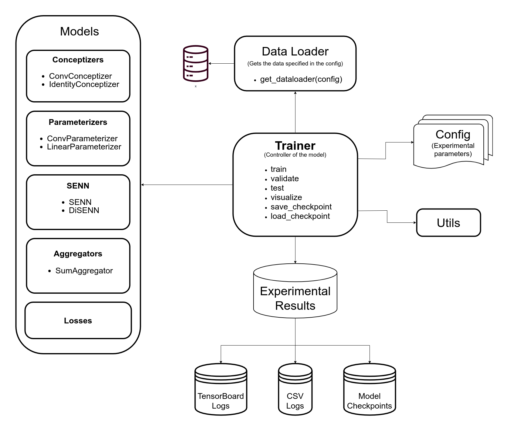

# Evaluating Explainable AI. A Comparative Study of SENN, IG, and LIME
By Alessandra Gandini and Gaudenzia Genoni  
University of Trento
***

This study compares the intelligibility and faithfulness of explanations from a self-explainable neural
network (SENN) and two post-hoc methods—Integrated Gradients (IG) and LIME—on MNIST and
on a confounded MNIST dataset. Through a primarily qualitative analysis, supported by quantitative
measures, we show that SENN fails to provide meaningful explanations, while IG and LIME offer
more faithful and interpretable attributions. IG and LIME evaluations on the Confounded MNIST
reveal the typical Clever Hans effect.  

## Project Structure

(credit https://github.com/AmanDaVinci/SENN.git)

 
 

==> To reproduce our experiments, run Notebook_1_MNIST.ipynb and Notebook_2_CONFOUNDED.ipynb (using Google Colab is suggested).
