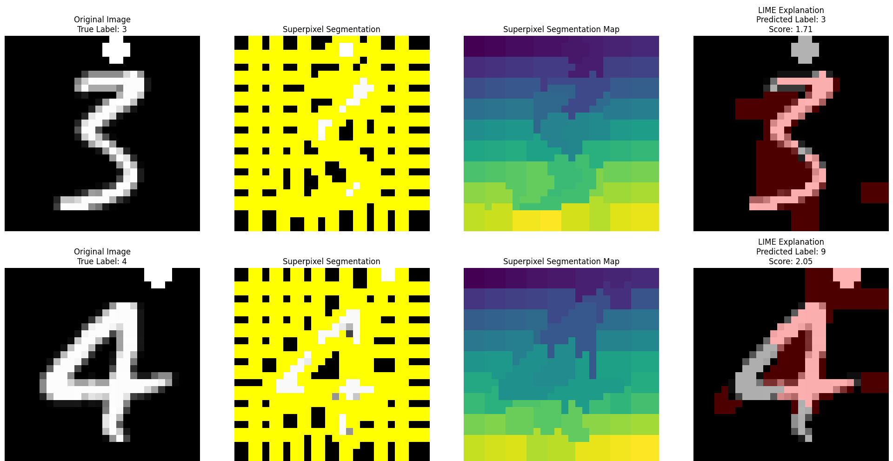

# Evaluating Explainable AI. A Comparative Study of SENN, IG, and LIME
By Alessandra Gandini and Gaudenzia Genoni  
University of Trento  
Machine Learning for NLP II (Professor Stefano Teso)
***

This repository contains the code for reproducing our final ML course paper, ["Evaluating Explainable AI. A Comparative Study of SENN, IG, and LIME"](Report.pdf). In the study, we compare the intelligibility and faithfulness of explanations from a self-explainable neural
network (SENN) and two post-hoc methods—Integrated Gradients (IG) and LIME—on MNIST and
on a confounded MNIST dataset. Through a primarily qualitative analysis, supported by quantitative
measures, we show that SENN fails to provide meaningful explanations, while IG and LIME offer
more faithful and interpretable attributions. IG and LIME evaluations on the Confounded MNIST
reveal the typical Clever Hans effect.  

## Table of Contents
  1. [Project Structure](#project-structure)
  2. [Results](#results)
  3. [Authors](#authors)
  4. [References](#references)

## Project Structure

(credit https://github.com/AmanDaVinci/SENN.git)

## Results
[Notebook_1_MNIST](Notebook_1_MNIST.ipynb) and [Notebook_2_confounded](Notebook_2_CONFOUNDED.ipynb) can be run to reproduce our experiments. Here are the major results:
1. Test accuracy on MNIST: 98.9%.
2. Test accuracy on Confounded MNIST: 34%.
3. SENN prototypes: 
4. SENN explanation sample: 
5. IG explanation sample for MNIST: 
6. IG explanation sample for Confounded MNIST: 
7. IG faithfulness on masked-pixels: 
8. LIME explanation samples for MNIST: 
9. LIME explanation samples for Confounded MNIST: 
10. LIME faithfulness on masked-superpixels: 

## Authors
* Alessandra Gandini (alessandra.gandini@studenti.unitn.it) 
* Gaudenzia Genoni (gaudenzia.genoni@studenti.unitn.it)

## References
David Alvarez-Melis and Tommi Jaakkola. Towards robust interpretability with self-
explaining neural networks. In Advances in Neural Information Processing Systems
(NeurIPS), volume 31, pages 7775–7784, 2018.

Omar Elbaghdadi, Aman Hussain, Christoph Hoenes, and Ivan Bardarov. Self explaining
neural networks: A review. Technical report, University of Amsterdam, 2020. Available on
GitHub at https://github.com/AmanDaVinci/SENN.git. 

